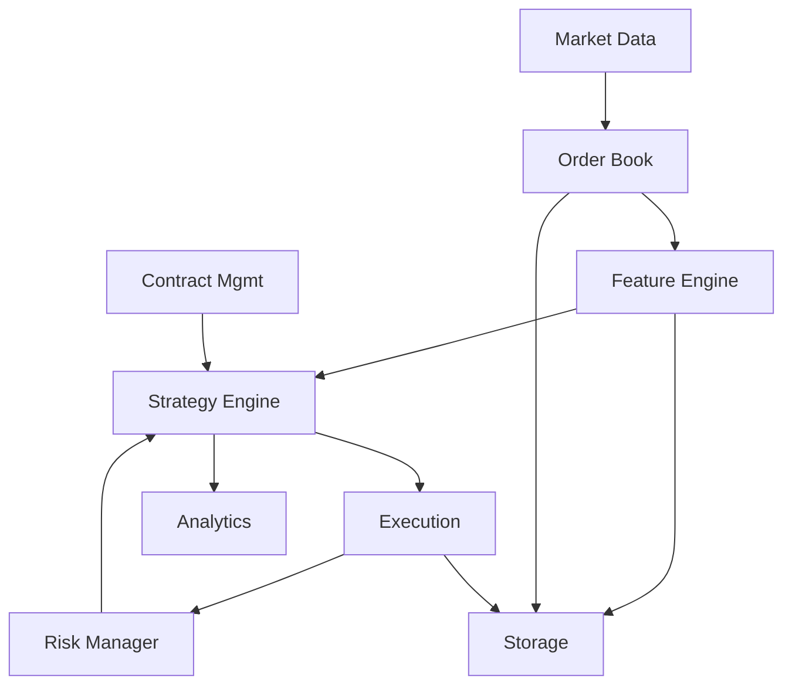

# Algotrading System Architecture

## Overview

This document outlines the modular architecture for the algotrading system, designed to be extensible, testable, and maintainable.

## Core Design Principles

1. **Separation of Concerns**: Each module has a single, well-defined responsibility
2. **Dependency Injection**: Components depend on traits, not concrete implementations
3. **Event-Driven Architecture**: Components communicate through events/messages
4. **Testability**: All components can be tested in isolation
5. **Performance**: Zero-cost abstractions where possible, efficient data structures

## Module Structure

```
algotrading/
├── core/                 # Core domain types and traits
│   ├── types.rs         # Common types (Price, Quantity, InstrumentId, etc.)
│   ├── events.rs        # Event definitions
│   └── traits.rs        # Core traits/interfaces
│
├── market_data/         # Market data ingestion and processing
│   ├── mod.rs
│   ├── reader.rs        # File/stream readers
│   ├── decoder.rs       # Format decoders (DBN, etc.)
│   └── normalizer.rs    # Normalize to internal format
│
├── order_book/          # Order book reconstruction and management
│   ├── mod.rs
│   ├── book.rs          # Single instrument book
│   ├── market.rs        # Multi-instrument market
│   └── events.rs        # Order book events
│
├── features/            # Feature engineering for ML
│   ├── mod.rs
│   ├── microstructure.rs # Book imbalance, depth, spread
│   ├── flow.rs          # Trade flow, volume analysis
│   ├── technical.rs     # Technical indicators
│   ├── statistical.rs   # Rolling stats, correlations
│   ├── pipeline.rs      # Feature computation pipeline
│   └── storage.rs       # Feature storage/retrieval
│
├── contract_mgmt/       # Contract selection and rolling
│   ├── mod.rs
│   ├── selector.rs      # Contract selection logic
│   ├── calendar.rs      # Calendar calculations
│   └── symbology.rs     # Symbol mapping
│
├── strategy/            # Trading strategy framework
│   ├── mod.rs
│   ├── traits.rs        # Strategy trait
│   ├── context.rs       # Strategy execution context
│   ├── ml/              # ML-based strategies
│   │   ├── mod.rs
│   │   ├── models.rs    # Model interfaces
│   │   └── inference.rs # Real-time inference
│   └── examples/        # Example strategies
│
├── execution/           # Order execution (simulation/live)
│   ├── mod.rs
│   ├── simulator.rs     # Backtesting execution
│   ├── paper.rs         # Paper trading
│   └── live.rs          # Live trading interface
│
├── risk/                # Risk management
│   ├── mod.rs
│   ├── position.rs      # Position tracking
│   ├── limits.rs        # Risk limits
│   └── pnl.rs          # P&L calculation
│
├── analytics/           # Performance analytics
│   ├── mod.rs
│   ├── metrics.rs       # Performance metrics
│   ├── reporter.rs      # Report generation
│   └── visualization.rs # Chart generation
│
├── storage/             # Data persistence
│   ├── mod.rs
│   ├── timeseries.rs    # Time series storage
│   ├── cache.rs         # In-memory caching
│   └── persistence.rs   # Disk persistence
│
└── utils/               # Utilities
    ├── mod.rs
    ├── time.rs          # Time utilities
    └── math.rs          # Math utilities

```

## Component Interactions



## Feature Engineering Module

The `features` module is responsible for calculating market microstructure features and technical indicators for downstream ML models.

### Key Features to Calculate:

#### Microstructure Features
- **Book Imbalance**: (bid_size - ask_size) / (bid_size + ask_size)
- **Book Pressure**: Weighted average of book depth
- **Spread**: ask - bid (absolute and relative)
- **Mid-price Changes**: Rate of change in mid-price
- **Order Flow Imbalance**: Buy volume - Sell volume
- **Queue Position**: Position in order queue

#### Flow Features
- **Volume Profile**: Volume distribution by price level
- **Trade Intensity**: Number of trades per time unit
- **Large Trade Indicators**: Detection of block trades
- **Cumulative Volume Delta**: Running sum of signed volume
- **VWAP**: Volume-weighted average price

#### Statistical Features
- **Rolling Volatility**: Various windows (1min, 5min, 30min)
- **Rolling Correlations**: Cross-asset correlations
- **Price Momentum**: Multiple timeframes
- **Mean Reversion Indicators**: Z-scores, half-life
- **Autocorrelation**: Lag correlations

#### Technical Indicators
- **Moving Averages**: SMA, EMA, WMA
- **Bollinger Bands**: Dynamic support/resistance
- **RSI**: Relative strength index
- **MACD**: Trend following

### Feature Pipeline

```rust
pub trait FeatureCalculator {
    type Input;
    type Output;
    
    fn calculate(&mut self, input: &Self::Input) -> Self::Output;
    fn window_size(&self) -> usize;
}

pub struct FeaturePipeline {
    calculators: Vec<Box<dyn FeatureCalculator>>,
    buffer: RingBuffer<MarketUpdate>,
}

impl FeaturePipeline {
    pub fn add_feature<F: FeatureCalculator>(&mut self, calc: F);
    pub fn process(&mut self, update: MarketUpdate) -> FeatureVector;
}
```

## Key Traits

```rust
// Core traits that define component interfaces

pub trait MarketDataSource {
    fn subscribe(&mut self, instruments: Vec<InstrumentId>) -> Result<()>;
    fn next_update(&mut self) -> Option<MarketUpdate>;
}

pub trait OrderBook {
    fn update(&mut self, msg: MboMsg);
    fn best_bid(&self) -> Option<PriceLevel>;
    fn best_ask(&self) -> Option<PriceLevel>;
    fn depth(&self, levels: usize) -> BookDepth;
}

pub trait FeatureEngine {
    fn register_calculator(&mut self, name: &str, calc: Box<dyn FeatureCalculator>);
    fn calculate_features(&mut self, book: &dyn OrderBook) -> FeatureVector;
    fn get_feature_names(&self) -> Vec<String>;
}

pub trait Strategy {
    fn on_book_update(&mut self, ctx: &mut Context, book: &dyn OrderBook);
    fn on_features(&mut self, ctx: &mut Context, features: &FeatureVector);
    fn on_trade(&mut self, ctx: &mut Context, trade: &Trade);
    fn on_fill(&mut self, ctx: &mut Context, fill: &Fill);
}

pub trait MLModel {
    fn predict(&self, features: &FeatureVector) -> Prediction;
    fn update(&mut self, features: &FeatureVector, outcome: &Outcome);
}

pub trait Executor {
    fn submit_order(&mut self, order: Order) -> Result<OrderId>;
    fn cancel_order(&mut self, id: OrderId) -> Result<()>;
    fn modify_order(&mut self, id: OrderId, new_order: Order) -> Result<()>;
}

pub trait RiskManager {
    fn check_order(&self, order: &Order, position: &Position) -> Result<()>;
    fn update_position(&mut self, fill: &Fill);
    fn get_limits(&self) -> &RiskLimits;
}
```

## Event Flow

1. **Market Data Event**: Raw market data arrives
2. **Normalization**: Convert to internal format
3. **Book Update**: Update order book state
4. **Feature Calculation**: Compute all registered features
5. **Strategy Signal**: Strategy processes features/ML predictions
6. **Risk Check**: Validate against risk limits
7. **Order Submission**: Send order to execution
8. **Fill Event**: Process execution result
9. **Position Update**: Update positions and P&L
10. **Analytics**: Record metrics and features

## Configuration

Each module should be configurable via:
- TOML configuration files
- Environment variables
- Command-line arguments

## Testing Strategy

1. **Unit Tests**: Test each module in isolation
2. **Integration Tests**: Test module interactions
3. **Simulation Tests**: Full system tests with historical data
4. **Property Tests**: Use proptest for complex scenarios
5. **Feature Validation**: Statistical tests for feature stability

## Performance Characteristics

The system has been optimized to hardware limits:

### Achieved Performance
- **Order Book Reconstruction**: 17.86M events/second (99% of theoretical maximum)
- **Full Backtesting**: 3.55M events/second (hardware limited at 843 CPU cycles/event)
- **Parallel File Processing**: 114.75M events/second aggregate across cores

### Key Optimizations
1. **Memory-Mapped I/O**: Zero-copy file reading with mmap
2. **Producer-Consumer Pattern**: 4KB batching for cache efficiency
3. **Lock-Free Channels**: Crossbeam channels for thread communication
4. **Pre-allocated Buffers**: No allocations in hot paths
5. **Fixed-Point Arithmetic**: Price as i64 with 9 decimal places
6. **BTreeMap/HashMap Hybrid**: O(log n) sorted levels, O(1) order lookup

### Hardware Analysis
- **CPU Bound**: < 1000 cycles/event indicates frequency limited
- **Not Memory Bound**: Using 0.9 GB/s of 50+ GB/s available
- **Cache Efficient**: Batch processing keeps data in L1/L2 cache

### Parallelization Strategy
Since backtesting is inherently sequential, parallelization is limited to:
- Multiple strategies on same data
- Parameter optimization sweeps  
- Feature pre-computation (can save to Arrow/Parquet)
- Multiple independent instruments

## Future Extensions

1. **Multi-Asset Support**: Extend beyond futures
2. **Distributed Processing**: Scale across machines
3. **Real-time Monitoring**: Web-based dashboard
4. **Cloud Deployment**: Kubernetes support
5. **Feature Store**: Centralized feature management
6. **Online Learning**: Adaptive ML models